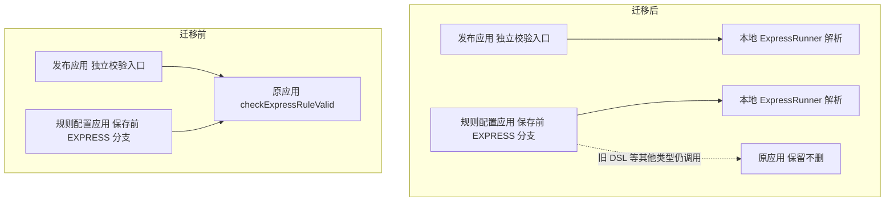

# 表达式语法校验迁移到调用方

> 状态：Draft · 版本：v2（可读性试点，设计内容与已审批的 v1 相同，只改结构与表达）· 日期：2026-09-18 · 主 profile：migration-remediation

相关文档：

- 需求：`../../requirements/summary.md`（v1.2.0，AC-001 到 AC-006，用户已确认保留旧入口、特殊表达式依赖列为上线前核查项）
- 已审批的原方案：`../solution.md`（v1，round-1 通过，`../../solution-review/rounds/round-1/report.md`）
- 原校验实现：`server_strategy_decision_java-impl/.../invoker/PackageFieldInfoServiceImpl.java:158`
- 发布应用独立校验入口：`server_credit_ser_deploy_java-impl/.../deploy/ExpressRuleDeployServiceImpl.java:437`
- 规则配置共同转换点：`rcrule-dataconfig-impl/.../logic/RuleXmlConvertLogic.java:81`
- 追踪与治理：`traceability.md`

## 摘要

两个调用方校验表达式语法时都远程调用原应用一个只解析、不查数据的方法。方案是各自在本地用同版本 QLExpress 3.2.0 解析，保留原空值判断、错误码和保存顺序，发布应用顺带删掉无用注入。最大风险是类路径差异改变特殊表达式的接受范围，靠上线前用存量规则对照实测拦住。待裁定：无。

## 1. 背景与目标

### 1.1 现状与问题

两条路径共用原应用的语法解析。发布应用的"独立校验"入口调用原服务后原样返回 `ResultVo`；发布应用新建规则和更新草稿先远程调用规则配置应用，后者在保存前按规则类型校验，EXPRESS 类型走同一个原服务方法，再包装 XML、写入规则版本 [E-6]。

原服务每次 `new ExpressRunner(true, true)` 后调用 `parseInstructionSet`，成功返回 `0/ok`，异常转为错误码 `16092603` 和原始异常文本。它不读业务数据库和缓存，所以可以搬到调用方；但"只解析"不等于结果与类路径无关：`include` 会读 classpath 资源，类引用会触发类加载，离线样例已证明补齐 `.ql` 资源或 Java 类型会改变解析结果 [E-5]。

两个调用方都声明 Java 7，本地是 JDK 8u432，所以本地跑通的类路径结论不能替代目标 JDK 上的验证；两个 impl 的 Surefire 都写死 `skipTests=true`，普通 `mvn test` 成功不代表测试跑过 [E-3][E-4]。2026-09-14 两应用主源码编译通过，可作为实施基线 [E-7]。

### 1.2 目标与非目标

目标是解除这两处对原方法的远程依赖，且对外行为不变：独立校验的签名、正常响应、语法错误和空值错误都与原来一致（AC-001）；共同保存路径只替换 EXPRESS 分支，trim、空白跳过和 XML 顺序不变（AC-002）；旧规则、复制、参数分组、异常包装和写入回滚边界保持既有行为（AC-003）；固定 3.2.0 与 Java 7 并完成类和资源依赖对照（AC-004）；两处出站调用被移除并有启动和主动调用证据（AC-005）；其他旧入口和原 API 类型依赖保留，不扩大到原应用下线（AC-006）。

非目标：旧 DSL、字段和知识包解析、试跑、函数列表的迁移；删除原应用接口或整个应用；删除仍有类型用途的 API 包；重构规则保存事务；新增规则语法限制。

### 1.3 约束、假设与术语

范围由用户点名的两个应用、一个目标方法和用户的两项答复定义，`evidence/scope-source.txt` 保存原文；代码检索只是定位辅助，不能据此扩大清理范围。两项答复是"旧入口先保留"和"特殊表达式依赖不清楚，列为上线前核查项"，它们允许继续设计、实施与非生产验证，不构成略过语料核查直接上线的授权。

术语：原应用指 `server_strategy_decision_java`；发布应用指 `server_credit_ser_deploy_java`；规则配置应用指 `server-rcrule-dataconfig-java`；目标方法指 `PackageFieldInfoService.checkExpressRuleValid`。

## 2. 方案概览

### 2.1 一句话方案与主图

两个调用方各自在本地用同版本 QLExpress 解析语法，原应用的方法和接口在迁移期间原样保留。下图对照迁移前后两条路径的走向：

迁移后发布应用不再持有目标服务的注入和 reference；规则配置应用仍保留对原应用的其他调用（旧 DSL 校验、字段解析），只是 EXPRESS 分支不再出站。

### 2.2 关键决策

- 两个调用方各保留一份简短的本地解析实现，不新建公共组件（DEC-001）。各自发布和回滚，十来行逻辑不值一个共享 SDK；两份逻辑的漂移用同一组行为断言控制。
- 固定 QLExpress 3.2.0，使用全局单例解析器，参数保持 `(true, true)`（DEC-002）。与原实现一致，不引入缓存、线程池、超时包装或版本升级。
- 校验失败保持原路径，不做 RPC 自动回退（DEC-003）。自动回退会掩盖本地不兼容并保留待下线的依赖；发现差异就停止扩量并回滚应用制品。
- 先切独立校验入口，再切共同保存路径（DEC-004）。独立入口调用量小，先切风险低；接口签名不变，两应用没有原子共发要求，顺序反过来也不构成协议不兼容。

不把校验集中到一个新增服务，那只是把 RPC 依赖换个地方；不复用原应用 impl 包获取错误枚举，那会引入本次不需要的运行时依赖。

### 2.3 为什么这样能成立

原方法没有业务数据依赖，本地用同版本解析器、同样的构造参数和同样的返回契约，正常和语法错误两条路径与原来逐字段等价。唯一不由代码保证的是类路径：include 资源和 Java 类型在调用方 classpath 里可能缺失。所以上线前必须拿真实存量规则在三套制品的 classpath（发布应用、规则配置应用的目标制品，以及线上原应用制品）下只解析比对，结果一致才允许生产切换；不一致时不切回远程掩盖，而是修制品依赖或停止迁移。原服务保留，旧制品回滚后依赖仍在。

## 3. 详细设计

### 3.1 保存前本地校验，外部请求继续沿原入口流转

以更新草稿为例：发布应用仍检查草稿状态和版本，再调用规则配置应用更新规则；规则配置在原来的 EXPRESS 分支本地解析，成功才继续包装 XML、插入新版本和下线旧版本。发布应用收到成功结果后再更新关联版本。原来的保存顺序与失败边界不需要移动。

独立语法校验仍从原发布应用接口进入，先执行原来的空值判断，再本地解析并返回 `ResultVo`。它不再调用原应用，也不额外调用规则配置应用。

### 3.2 按用途分类：迁移、删除、保留

对象分三类：目标方法的出站调用迁移；发布应用随调用消失的注入和 reference 删除；旧规则调用和 XML 类型用途保留。调用点定位见证据 E-1，全仓检索已确认注册中心上没有其他任何消费者调用该方法，清理前不需要再复核。

唯一的未知项是业务语料是否依赖特定类和资源。它不会被静态搜索"没找到 .ql 文件"自动判定为不存在；此前另一个需求核查过的贷后事件规则样本属于不同业务表，也不能代替这批规则的语料。

### 3.3 解析契约留在当前请求中

在既有服务实现类中加入或内联简短的兼容解析方法，不新增 Spring bean 或对外方法。解析前后都不移动保存操作；每次新建 runner，没有共享实例，不改变调用方的事务入口。

解析和返回：`new ExpressRunner(true, true)` 后只调用 `parseInstructionSet`。成功构造原 `ResponseCode.NORMAL` 对应的 `ResultVo`；失败捕获 `Throwable`，用 `e.getMessage()` 与错误码字符串 `16092306` 构造 `ResultVo`。两参构造器顺序是 `(msg, code)`，rows 保持 null。错误日志落到调用方现有 LOGGER，不添加规则执行或远程回退。

各入口的既有差异原样保留：

| 入口或阶段 | 目标行为 |
|---|---|
| 发布应用独立校验 | req 为 null 或 `StringUtils.isBlank` 为真时仍抛 `16092506`；非空内容按原文解析，不额外 trim |
| 发布应用新建/更新草稿 | 保留原 ParamValid 分组及 Bean 定义，继续由规则配置应用承担保存前校验 |
| 规则配置 DTO 与 XML 转换 | 保留 setter 的 trim；EXPRESS 原 `isNotBlank` 门槛不变；空白跳过，null 在 XML 写入前转空串 |
| 规则配置解析失败 | 按原 retcode 判断抛 `RuleException`，由既有外层 API/RPC 包装 |
| 非 EXPRESS 与复制 | 维持原分流和是否校验的行为，复制入口不加新校验 |

能力边界：只解析，不执行表达式，不新增字段存在性、函数注册、布尔返回值、除零等业务检查；未知字段或未注册函数当前可能通过语法解析，这次迁移不收紧。解析器的类解析会触发 `Class.forName`，`include` 会读 classpath 资源，所以对任意 Java 类引用的完整输入空间，同版本不能保证两应用与原服务完全等价。若业务依赖任意原服务类型且无法通过既有依赖补齐，返回方案设计评估隔离类加载或其他实现。

依赖：按 DEC-007 的结论，在两个实际调用解析器的 impl 模块直接声明 `com.alibaba:QLExpress:3.2.0`，保持 `log4j:log4j` 排除，不给原 impl 加依赖；保留已有 API 包中 XML 类型的使用。依赖树和最终包都核查 3.2.0。runner 参数、版本、返回契约三者构成共同回归基线。

### 3.4 分批切换的进入与完成条件

阶段规则统一放在第 6 章。编码和本地回归可以先进行；进入生产灰度前必须完成语料与制品对照、实际目标测试和非生产主动调用。原服务在两个调用方迁移期间始终保留。

两个应用混合新旧版本时，旧实例继续走原 RPC，新实例走本地解析。只有在生产灰度前已证明当前有效语料一致，这一版本窗口才可接受；类路径仍为 Unknown 时不开始生产切换。

### 3.5 失败时停止扩量，回滚应用制品

（本节按 round-2 的 F-03 修订，v3 订正了回退语义，reviewer 请注意此处已与 F-03 对齐。）语法错误按 3.3 返回；保存事务仍由原规则配置服务处理。网络超时、找不到原服务等目标 RPC 故障在新实现中消失，这是解除依赖的预期收益，不模拟这些已删除的传输故障。

本地解析因资源或类缺失导致结果变化时，不切回远程掩盖差异。发布前发现就修正制品依赖或停止迁移；灰度发现就停止扩量并回滚对应应用。原服务和原接口不删除，旧制品恢复后仍有原依赖可用。

若怀疑本地校验错误接受了规则，先暂停该测试或编辑流程，核对本次影响的 ruleCode/version 及发布状态；回滚二进制不会自动删除已写规则，确有受影响数据时按明确记录单独处理。

### 3.6 保持不变的行为

旧 DSL 仍调用原服务，EXPRESS 不再调用目标方法；更新失败时版本状态、写入次数和回滚表现不变；复制仍按原行为；外层不同异常包装不合并。证明方式是以相同入参比较前后响应和调用依赖，具体回归入口见第 6 章与 `traceability.md`。

## 4. 替代方案与取舍

新增一个共享校验服务或 SDK。它只是把 RPC 依赖转移到新组件，或为十余行逻辑增加一个发布单元；两份短实现加共同断言更便宜。

复用原应用 impl 包里的错误枚举。能少写一个常量，但会把原应用 impl 的运行时依赖带进调用方，与"解除依赖"的目标相反。

本地解析失败时自动回退远程。看似更安全，实际会掩盖类路径不兼容，并让待下线的依赖永远删不掉。

## 5. 影响与兼容

发布应用：独立校验在本地完成，删除对应注入和 reference；`newRule`/`updateDraft` 的保存 RPC、`XmlUtil`/`Rule` 依赖、对外接口签名不变。规则配置应用：EXPRESS 在共同转换点本地解析；其他类型、`PackageFieldInfoService` 的其他用途、DAO、事务和版本逻辑不变。原应用：两类调用减少，迁移期间继续可用，所有接口定义和其他消费者本次不删。网关和 UI 通过相同接口收到原有业务格式，路由、字段名、空值提示和统一错误包装不变。

## 6. 发布、验证与回滚

### 6.1 P0 实施前与本地验证

进入条件是冻结需求、方案与代码基线并形成测试清单。通过信号是两应用编译通过，且目标测试实际执行、执行数非零：因为 Surefire 默认跳测，用 `test-compile` 生成测试类、`dependency:build-classpath` 生成模块测试 classpath，再显式运行 `org.testng.TestNG -testclass <本次测试类>` 并保存报告；用例覆盖正常、异常、空值、旧分支和保存顺序。本地变更可撤销，不提交、不发布生产。

### 6.2 P1 语料和制品兼容

进入条件是 P0 通过。动作是核对正式构建包和线上原制品；取仍可编辑、发布、回滚的 EXPRESS 规则 code/version，抽取 XML 内 `Rule.value`，盘点 include、import、业务类及其传递资源依赖，在受控环境只解析比较。通过信号是普通与特殊规则在三套制品 classpath（两个调用方的目标制品与线上原应用制品）下的接受与拒绝结果一致，兼容场景的 retcode、retmsg、rows 一致。覆盖不清或有差异就停止生产切换；不对生产规则调用 execute，关键词命中统计不能代替解析比对。

### 6.3 P2 非生产主动验收

两应用分别使用目标制品，验证独立校验、新建、更新草稿、旧 DSL 与失败回滚，确认没有目标服务注入残留。通过信号是目标场景的记录、响应及调用追踪可复核，旧功能回归成立，发布应用启动不依赖被删除的 reference。失败就修正后重验。

### 6.4 P3 生产分批切换

取得明确发布授权后，推荐先规则配置应用、再发布应用，每个应用先小批实例。每一批都主动触发目标场景：应迁移调用点的出站目标方法为 0，场景成功数非零。

### 6.5 P4 迁移验收

两应用全部目标实例完成切换并主动验证；按方法符号和装配扫描残留，再核对客户端指标。验证覆盖独立校验和两类保存，不用"近期零流量"代替主动验证。本阶段只宣布本方法两处迁移完成，删除原接口或原应用须另行核查其他消费者与依赖。

## 7. 风险与未决问题

> 评审操作说明：评审完成后请把 findings 写入同目录的 `findings.md`，并在 `status.txt` 写入 DONE。

特殊规则可能依赖原服务 classpath，甚至涉及类初始化差异。这是最大风险，P1 的语料对照是上线前阻断条件；用户已同意列为核查项，没有授权略过。

两份短实现未来可能漂移。固定版本与共同语料断言约束，本次不引入新共享组件。

SNAPSHOT、JDK 与实际制品不能由本地 POM 单独证明。P1 核对最终包、原制品和实际运行 JDK。

默认跳过测试容易产生假通过。P0 要求目标测试有非零执行数的报告，依赖解析或 compile 成功不算测试通过。

还需要用户裁定一项：是否顺带把 QLExpress 升级到 3.3.x，升级能减少一个已知的 include 解析问题，但会改变解析语义。若语料表明必须收紧语法或删除旧入口，那会改变已确认边界，届时单独确认，不在本方案内提前实施。
