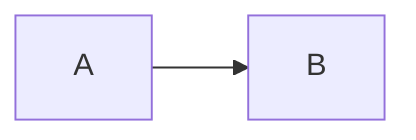

# P2 结构探针

第一段第一行
硬换行后的第二行。

第二段紧跟着。
- 段落后直接开始的列表项

## 列表

- 紧凑列表 A
  - 嵌套 A1
  - 嵌套 A2
- 紧凑列表 B

  ```java
  int x = 1;
  ```

- 松散列表 C

- 松散列表 D

3. 从 3 开始的有序
4. 第四项
   - 子项
   继续的段落文字

- [ ] 待办一
- [x] 待办二
- 待办后的普通项

## 引用与分割

> 引用第一段
>
> 引用第二段

Setext 标题
---

***

## 表格与图片

| a | b |
|---|---|
| 1 | 2 |


文字中间  图片后还有字

## 代码、高亮块、图

```sql
SELECT 1;
```

> [!TIP]
> 高亮块内容



<grid><column width-ratio="0.5"><p>左</p></column><column width-ratio="0.5"><p>右</p></column></grid>

最后一段<br>带换行
